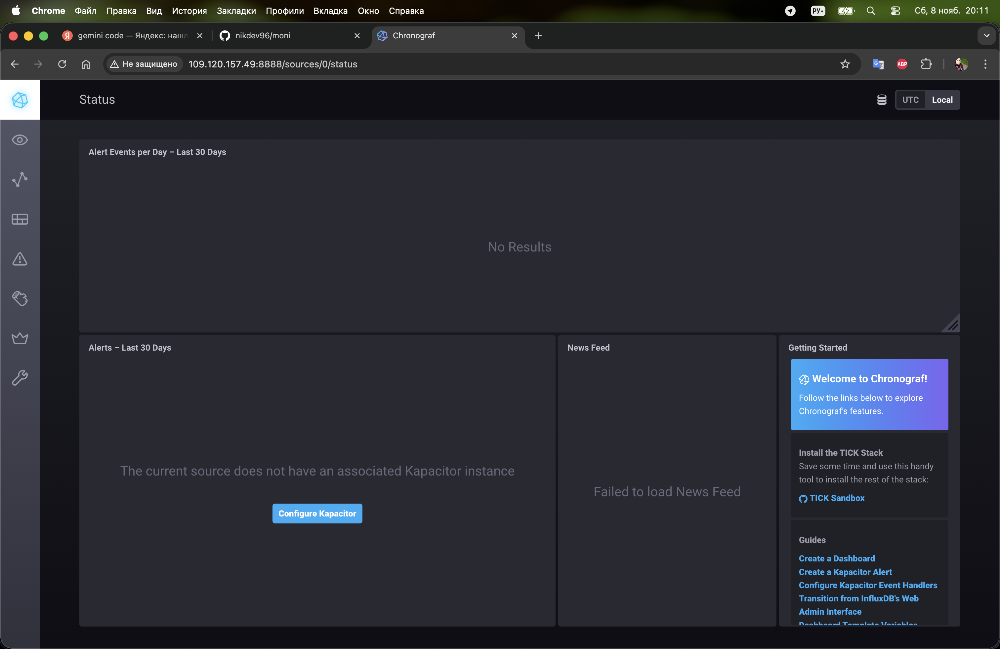
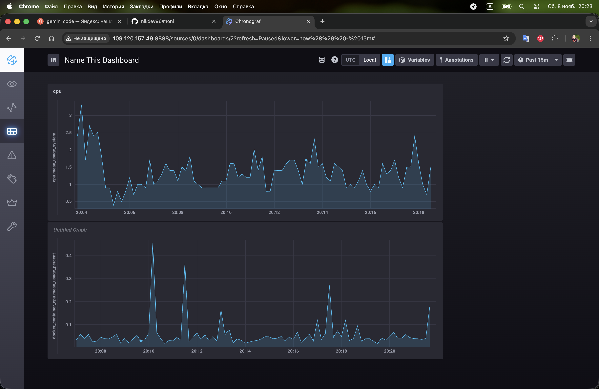

# Домашнее задание: Системы мониторинга

Выполнил: Nikita
Репозиторий: [github.com/nikdev96/moni](https://github.com/nikdev96/moni)

---

## Задание 1: Минимальный набор метрик

**Вопрос:** Какие метрики нужны для платформы вычислений с HTTP-интерфейсом, которая сильно загружает процессор и сохраняет отчёты на диск?

**Ответ:**

**HTTP-метрики:**
- Время отклика (p50, p95, p99)
- Количество запросов в секунду
- HTTP коды ответов (2xx, 4xx, 5xx)
- Количество активных соединений

**CPU-метрики:**
- Утилизация процессора (%)
- Load Average (за 1, 5, 15 минут)
- CPU time по процессам

**Дисковые метрики:**
- Свободное место на диске
- Скорость записи/чтения (IOPS)
- Задержки дисковых операций

**Память и сеть:**
- Использование RAM и Swap
- Сетевой трафик (in/out)

**Почему именно эти метрики:**
- HTTP метрики показывают качество обслуживания пользователей
- CPU метрики критичны, т.к. идут тяжёлые вычисления
- Дисковые метрики важны, т.к. отчёты сохраняются на диск - нужно следить за местом и производительностью

---

## Задание 2: Бизнес-метрики для менеджера

**Вопрос:** Менеджер не понимает технические метрики (RAM, CPU load). Он хочет знать качество обслуживания клиентов.

**Ответ:**

Нужно перевести технические метрики в понятные бизнес-показатели:

**Доступность (Availability):**
- Вместо "uptime" → "Сервис доступен 99.9% времени"
- Это значит не более 43 минут простоя в месяц

**Скорость (Performance):**
- Вместо "p95 response time 500ms" → "95% пользователей получают ответ быстрее полсекунды"

**Надёжность (Reliability):**
- Вместо "error rate 0.1%" → "999 из 1000 запросов выполняются успешно"

**Производительность:**
- "Обрабатываем 10 000 запросов в минуту"
- "Среднее время восстановления после сбоя: 5 минут"

**Error Budget (бюджет ошибок):**
- "Использовано 20% бюджета ошибок за месяц, осталось 80%"

Такие метрики показывают насколько хорошо мы выполняем обязательства перед клиентами.

---

## Задание 3: Сбор логов без бюджета

**Вопрос:** Нет денег на систему логирования. Как разработчики будут получать ошибки приложения?

**Ответ:**

**Бесплатные SaaS решения:**
- Sentry (бесплатно до 5000 ошибок/месяц)
- Rollbar, Bugsnag (есть free tier)
- Интеграция в Telegram/Slack через webhook

**Open Source решения:**
- Loki + Grafana (легковесная альтернатива ELK)
- Graylog Community Edition
- ELK Stack (Elasticsearch + Logstash + Kibana) - тяжеловесно, но бесплатно

**Простые решения:**
- Логи в stdout/stderr + `docker logs` или `journalctl`
- Rsyslog для централизованного сбора логов на файловую систему
- Python скрипт для парсинга логов и отправки в Telegram

**Рекомендация:** Sentry (free tier) - готовое решение, группирует ошибки, показывает stack traces, присылает уведомления.

---

## Задание 4: Проблема с SLA метрикой

**Вопрос:** SLA метрика `sum_2xx_requests / sum_all_requests` показывает 70%, но кодов 4xx и 5xx нет. В чём ошибка?

**Ответ:**

**Проблема:** в формуле не учитываются все типы ответов.

**Что может быть:**

1. **3xx редиректы** - они не 2xx, поэтому снижают процент
   - Например: 70% запросов возвращают 2xx, 30% - редиректы 3xx

2. **Таймауты и сетевые ошибки**
   - Запросы, которые вообще не получили HTTP ответ
   - Балансировщик оборвал соединение
   - Connection timeout

3. **Невалидные запросы**, отброшенные до обработки

**Решение:**
- Проверить логи на наличие 3xx кодов
- Правильная формула: `(2xx + 3xx) / все_запросы * 100%`
- Или: `(все_запросы - 4xx - 5xx - таймауты) / все_запросы * 100%`

---

## Задание 5: Pull vs Push модели мониторинга

**Вопрос:** Чем отличаются pull и push модели мониторинга?

**Ответ:**

### Pull модель (сервер забирает метрики)

**Плюсы:**
- Сервер мониторинга контролирует когда и как часто собирать метрики
- Легко понять когда узел недоступен (failed scrape)
- Проще настроить безопасность
- Автоматическое обнаружение новых сервисов (Service Discovery)

**Минусы:**
- Не работает с NAT и файрволами (нужен доступ от сервера к агентам)
- Сложно мониторить короткоживущие задачи (batch jobs)
- Нужно открывать порты на всех узлах

### Push модель (агенты отправляют метрики)

**Плюсы:**
- Работает за NAT и файрволами (агентам нужен только исходящий доступ)
- Подходит для короткоживущих задач
- Агент сам решает когда отправлять данные
- Подходит для географически распределённых систем

**Минусы:**
- Сложнее обнаружить отказ агента (нет метрик != упал сервис)
- Нужно настраивать адрес сервера на каждом агенте
- Нужно защищать endpoint от неавторизованных агентов
- Возможна потеря метрик при недоступности сервера

**Вывод:** Pull для стабильной инфраструктуры, Push для динамичных сред и batch jobs.

---

## Задание 6: Классификация систем мониторинга

**Вопрос:** Какие системы используют pull, а какие push?

**Ответ:**

| Система | Модель | Описание |
|---------|--------|----------|
| **Prometheus** | **Pull** (гибрид) | Основная модель - pull (scraping). Pushgateway для batch jobs |
| **TICK** | **Push** | Telegraf собирает метрики и пушит в InfluxDB |
| **Zabbix** | **Гибрид** | Поддерживает оба: active checks (push) и passive checks (pull) |
| **VictoriaMetrics** | **Pull** (гибрид) | Совместим с Prometheus, поддерживает push через разные протоколы |
| **Nagios** | **Pull** | Сервер активно опрашивает хосты (NRPE) |

**Итого:**
- **Pull:** Prometheus, VictoriaMetrics, Nagios
- **Push:** TICK Stack
- **Гибрид:** Zabbix, VictoriaMetrics

---

## Практические задания

### Задание 7: Запуск TICK Stack

Развернул TICK Stack (Telegraf, InfluxDB, Chronograf, Kapacitor) в Docker.

**Что сделано:**
- Настроил docker-compose.yml с 4 контейнерами
- Запустил все сервисы
- Chronograf доступен на порту 8888

**Скриншот:**



---

### Задание 8: Data Explorer - график CPU

В Chronograf открыл Data Explorer и построил график утилизации процессора.

**Настройки:**
- Database: `telegraf.autogen`
- Measurement: `cpu`
- Field: `usage_system`

**Скриншот:**



*График показывает утилизацию CPU (верхняя панель) за последние 15 минут*

---

### Задание 9: Docker метрики

Добавил в Telegraf плагин для мониторинга Docker контейнеров.

**Конфигурация telegraf.conf:**
```toml
[[inputs.docker]]
  endpoint = "unix:///var/run/docker.sock"
  timeout = "5s"
```

**Настройки docker-compose.yml:**
- Добавил `privileged: true`
- Примонтировал `/var/run/docker.sock`
- Запустил Telegraf от пользователя с правами доступа к Docker

**Скриншот:**


*График показывает утилизацию CPU Docker контейнерами (нижняя панель)*

**Собираемые метрики:**
- `docker_container_cpu` - использование CPU контейнерами
- `docker_container_mem` - использование памяти
- `docker_container_net` - сетевой трафик
- `docker_container_blkio` - дисковый I/O

---

## Технические детали

### Структура проекта

```
.
├── docker-compose.yml       # Конфигурация TICK Stack
├── telegraf.conf            # Конфигурация Telegraf с Docker плагином
├── kapacitor.conf           # Конфигурация Kapacitor
├── screenshots/             # Скриншоты выполнения заданий
│   ├── 1.png               # Chronograf interface
│   └── 2.png               # CPU и Docker метрики
├── PRACTICE-TASKS.md        # Инструкции для заданий 7-9
├── CHECK-STATUS.md          # Диагностика проблем
└── README.md               # Этот файл
```

### Запуск

```bash
# Запустить TICK Stack
docker compose up -d

# Проверить статус
docker ps

# Открыть Chronograf
# http://localhost:8888
```

### Остановка

```bash
docker compose down

# С удалением данных
docker compose down -v
```

---

## Компоненты TICK Stack

- **InfluxDB** (порт 8086) - база данных временных рядов
- **Telegraf** - агент сбора метрик (CPU, память, диск, Docker)
- **Chronograf** (порт 8888) - веб-интерфейс для визуализации
- **Kapacitor** (порт 9092) - обработка данных и алерты

---

## Собираемые метрики

- CPU (утилизация, load average)
- Память (RAM, Swap)
- Диск (использование, IOPS)
- Сеть (трафик, ошибки)
- Системные процессы
- **Docker контейнеры** (CPU, память, сеть, I/O)

---

## Автор

Nikita
GitHub: [nikdev96/moni](https://github.com/nikdev96/moni)
